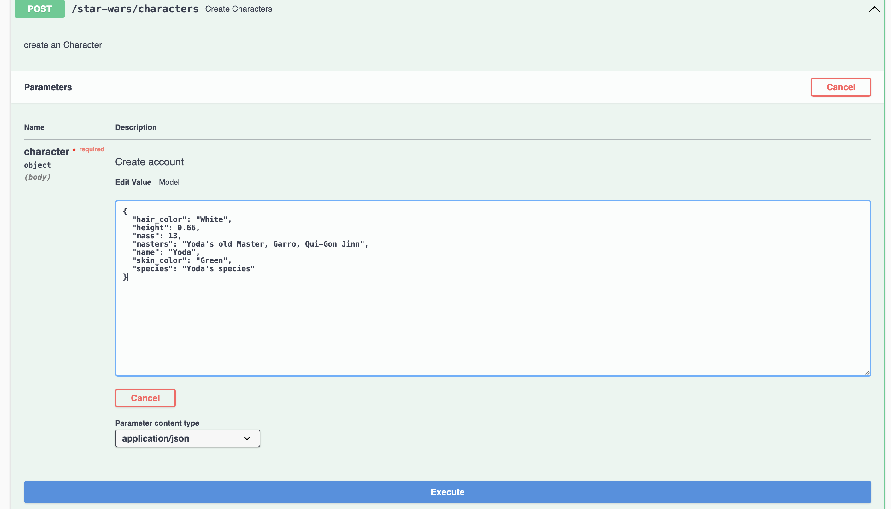
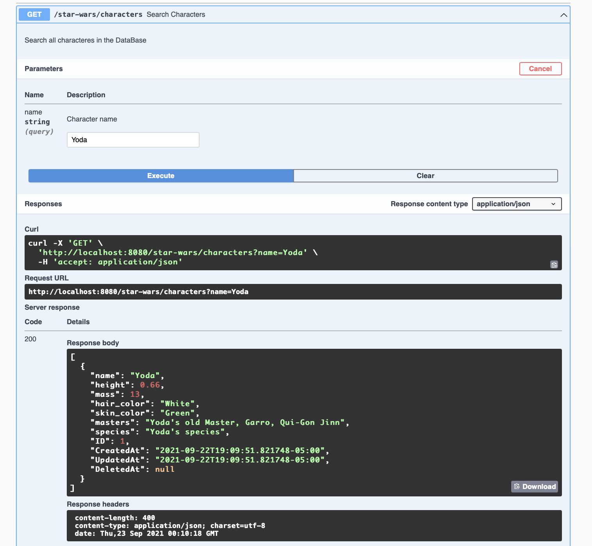
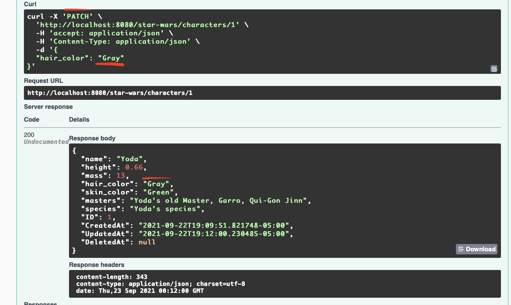

```
   _____ _          __          __            
  / ____| |         \ \        / /            
 | (___ | |_ __ _ _ _\ \  /\  / /_ _ _ __ ___ 
  \___ \| __/ _` | '__\ \/  \/ / _` | '__/ __|
  ____) | || (_| | |   \  /\  / (_| | |  \__ \
 |_____/ \__\__,_|_|    \/  \/ \__,_|_|  |___/

   _____ _                          _                
  / ____| |                        | |               
 | |    | |__   __ _ _ __ __ _  ___| |_ ___ _ __ ___ 
 | |    | '_ \ / _` | '__/ _` |/ __| __/ _ \ '__/ __|
 | |____| | | | (_| | | | (_| | (__| ||  __/ |  \__ \
  \_____|_| |_|\__,_|_|  \__,_|\___|\__\___|_|  |___/
                                                     
                                                   
           _____ _____ 
     /\   |  __ \_   _|
    /  \  | |__) || |  
   / /\ \ |  ___/ | |  
  / ____ \| |    _| |_ 
 /_/    \_\_|   |_____|
                                                                                   
```

# Let's get started

## Database configuration

You need to have a postgres database to run this api. If you don't have a server, just use docker.

```bash
 docker run --name postgres-db -e POSTGRES_PASSWORD=anakin1234 -e POSTGRES_DB=characters -e POSTGRES_USER=anakin -p 5432:5432 postgres
```

## Env variables

Then you have to set env variables (If you are using MacOS run source local.zsh):

*DB_HOST
*DB_USER
*DB_PASSWORD
*DB_NAME

## Run app installing

```bash
go install github.com/juanpipeline/star-wars-characters-api
```

```bash
$HOME/go/bin/star-wars-characters-api
```

## Run app using Docker

```bash
docker build -t goapp .
```

```bash
docker run -it -p 8080:8080 --env-file="local.env" goapp
```

## Run app using binary

```bash
./star-wars-characters-api
```

```bash
docker run -it -p 8080:8080 --env-file="local.env" goapp
```

## Interactive documentation with swagger

Go to: [http://localhost:8080/swagger/index.html#/default/get_characters]

## Examples

Now you can create Yoda into your database:



Then you can search Yoda by his name:



You can even change his hair color



## References

* https://github.com/swaggo/gin-swagger
* https://github.com/swaggo/swag#getting-started
* https://golang.org/doc/code
* https://swaggo.github.io/swaggo.io/
* https://github.com/swaggo/swag#declarative-comments-format
